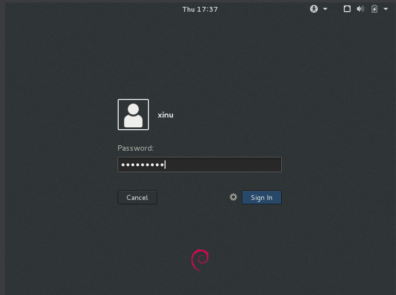
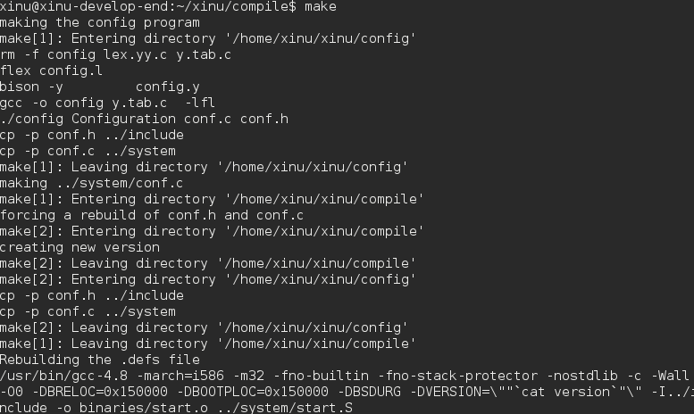
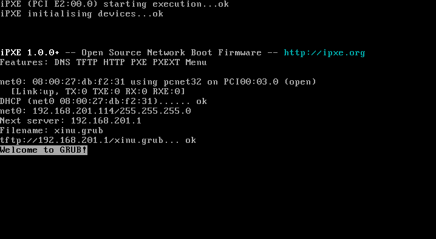
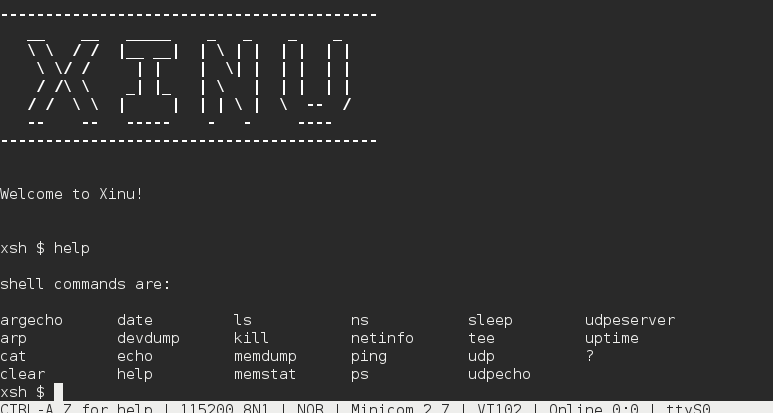

# Laporan Praktikum Sistem Operasi
## Modul 1, 2, dan 3: Instalasi, Arsitektur, dan Eksplorasi Xinu OS

### Identitas Praktikan
| Item | Keterangan |
|------|------------|
| **Nama** | [Moreno Maheswara Anggoro] |
| **NIM** | [108072500044] |
| **Kelas** | [IF-05-04] |


---

## 1. Tujuan Praktikum
Pada praktikum ini, kami bertujuan untuk memahami dasar-dasar penggunaan alat dan lingkungan kerja yang digunakan dalam mata kuliah Sistem Operasi. Selain itu, kami juga ingin memahami arsitektur sistem operasi Xinu serta cara kerja proses booting dan interaksi dengan sistem tersebut.

Tujuan secara khusus dari praktikum ini adalah:
1. Memahami aturan, tata tertib, dan kesiapan alat utama praktikum seperti VirtualBox, Ubuntu, Xinu OS, dan Sourcetrail.
2. Mengetahui konsep cross-development pada sistem operasi embedded Xinu yang membagi Development-System VM dan Backend VM.
3. Mampu melakukan kompilasi source code Xinu dan menjalankannya pada mesin target melalui jaringan menggunakan PXE dan TFTP.
4. Mampu mengakses dan mengeksplorasi shell Xinu melalui koneksi serial menggunakan Minicom.

---

## 2. Dasar Teori dan Arsitektur Sistem
Xinu merupakan sistem operasi kecil yang dirancang untuk lingkungan embedded. Sistem ini memiliki karakteristik yang berbeda dibandingkan dengan sistem operasi yang biasa digunakan pada komputer umum, karena lebih fokus pada efisiensi, modularitas, dan pengelolaan sumber daya yang sederhana. Salah satu konsep penting dalam Xinu adalah cross-development, yaitu proses pengembangan yang dilakukan di mesin host, sementara program dijalankan di mesin target yang berbeda.

Dalam praktikum ini, kami menggunakan dua mesin virtual yang berbeda, yaitu:
1. **Development-System VM**  
   Mesin ini berfungsi sebagai lingkungan pengembangan. Di dalamnya terdapat Debian Linux, source code Xinu, compiler, DHCP server, dan TFTP server.
2. **Backend VM**  
   Mesin ini berperan sebagai target eksekusi. Karena tidak memiliki sistem operasi utama di hard disk, VM ini akan melakukan booting melalui jaringan dengan memanfaatkan PXE dan mengambil image Xinu dari server TFTP.

Kedua mesin tersebut dihubungkan melalui Virtual Serial Port agar kami bisa berinteraksi dengan Xinu melalui terminal Development-System. Dengan demikian, kami dapat melihat dan mengontrol sistem target tanpa harus menggunakan antarmuka grafis pada mesin backend.

---

## 3. Langkah Kerja dan Hasil Eksplorasi

### 3.1 Login dan Kompilasi Source Code Xinu
Langkah pertama yang kami lakukan adalah masuk ke Development-System VM. Setelah sistem berhasil dijalankan, kami login ke Debian Linux menggunakan akun yang telah disediakan. Informasi login yang digunakan adalah:

- **Username:** `xinu`
- **Password:** `xinurocks`

  

Setelah berhasil login, kami masuk ke direktori tempat source code Xinu disimpan dan membersihkan hasil build sebelumnya agar proses kompilasi yang dilakukan menjadi lebih fresh dan akurat. Perintah yang digunakan adalah:

```bash
$ cd xinu/compile
$ make clean
$ make
```

Dari hasil proses tersebut, saya melihat bahwa source code Xinu berhasil dikompilasi menjadi image `xinu.elf`. Selain itu, file image tersebut secara otomatis dipindahkan ke direktori TFTP di `/srv/tftp/xinu.boot` agar dapat diakses oleh Backend VM saat proses booting dilakukan.



*Gambar 1: Proses kompilasi source code Xinu melalui perintah `make` pada Development-System VM.*

### 3.2 Booting Backend VM via PXE
Setelah kompilasi selesai, saya menjalankan Backend VM. Karena mesin target tidak memiliki sistem operasi yang tersimpan di hard disk, maka proses booting dilakukan secara jaringan. Proses tersebut mengikuti mekanisme PXE dan TFTP.

Urutan prosesnya adalah:
1. Backend VM menampilkan bootloader GRUB.
2. Mesin target meminta alamat IP dari DHCP Server yang berjalan di Development-System VM.
3. Backend VM mengambil file `xinu.boot` dari server TFTP.
4. Xinu berhasil dimuat ke memori dan mulai berjalan.

Dari proses ini, kami dapat melihat bahwa Xinu tidak memerlukan media penyimpanan lokal untuk dijalankan dalam mode target, melainkan memanfaatkan jaringan sebagai media pendistribusian boot image.



*Gambar 2: Tampilan Backend VM saat proses booting melalui PXE dan TFTP.*

### 3.3 Koneksi Serial Port Menggunakan Minicom
Untuk berinteraksi dengan Xinu yang sedang berjalan, saya kembali ke Development-System VM dan menjalankan aplikasi `minicom`. Aplikasi ini berperan sebagai terminal komunikasi serial yang terhubung ke mesin target.

Perintah yang digunakan adalah:

```bash
$ sudo minicom
```

Password yang diminta adalah `xinurocks`. Setelah koneksi berhasil dibuat, terminal saya berubah dari tampilan Linux biasa menjadi prompt Xinu dengan tanda `xsh$`. Hal ini menandakan bahwa kami sudah masuk ke shell Xinu dan siap untuk menjalankan perintah.



*Gambar 3: Koneksi berhasil melalui Minicom dan muncul prompt `xsh$`.*

### 3.4 Eksplorasi Perintah Shell Xinu
Setelah masuk ke shell Xinu, saya mulai mengeksplorasi perintah yang tersedia. Salah satu perintah yang saya coba adalah `help` untuk melihat daftar command yang dapat dijalankan pada sistem.

```bash
xsh$ help
```

Dari hasil eksekusi perintah tersebut, saya melihat bahwa shell Xinu cukup sederhana namun tetap memiliki fungsi dasar yang penting. Selain itu, saya juga mencoba beberapa perintah seperti `ls` dan `cd` untuk melihat struktur file dan navigasi direktori pada sistem. Aktivitas ini membantu kami memahami bahwa Xinu memang dirancang untuk lingkungan embedded dengan antarmuka yang lebih minimal dibandingkan sistem operasi desktop.


*Gambar 4: Hasil dari perintah `help` pada shell Xinu.*

---

## 4. Pembahasan
Dari praktikum yang telah saya lakukan, ada beberapa hal penting yang dapat saya pahami mengenai Xinu dan cara kerjanya.

Pertama, penggunaan dua VM dalam praktikum ini sangat mencerminkan prinsip cross-development yang umum digunakan pada sistem embedded. Proses kompilasi dan pengembangan dilakukan di mesin host, sementara target eksekusi dibuat di mesin lain. Cara ini sangat efisien karena pengembang tidak harus menulis dan menjalankan program langsung di perangkat target yang mungkin memiliki keterbatasan sumber daya.

Kedua, mekanisme booting melalui PXE dan TFTP menunjukkan bahwa sistem target tidak memerlukan hard disk atau media penyimpanan lokal untuk menjalankan sistem operasi. Melalui jaringan, mesin target meminta alamat IP dari DHCP server dan mengambil image sistem dari server TFTP. Ini merupakan pendekatan yang sangat cocok untuk sistem embedded atau perangkat yang dirancang untuk dijalankan secara ringan dan efisien.

Ketiga, penggunaan Minicom sebagai terminal serial sangat penting dalam komunikasi dengan Xinu. Karena Backend VM berjalan tanpa antarmuka grafis, serial port menjadi satu-satunya jalur interaksi utama. Dengan Minicom, kami bisa mengirim perintah ke target dan menerima hasil eksekusi secara langsung.

Keempat, shell Xinu yang muncul sebagai `xsh$` menunjukkan bahwa sistem operasi ini memang menyediakan antarmuka sederhana untuk menjalankan perintah dasar. Meskipun terlihat minimalis, shell tersebut sudah cukup untuk menjalankan beberapa tugas dasar seperti melihat daftar perintah, mengeksplorasi direktori, dan mengendalikan sistem secara sederhana.

Secara umum, praktikum ini memberi saya pemahaman bahwa sistem operasi embedded seperti Xinu memiliki struktur yang lebih ringan dibandingkan sistem operasi umum, tetapi tetap memiliki mekanisme dasar yang penting untuk pengelolaan sumber daya, eksekusi program, dan interaksi pengguna.

---

## 5. Kesimpulan
Berdasarkan praktikum yang telah saya lakukan, dapat disimpulkan bahwa Xinu OS merupakan sistem operasi embedded yang dirancang dengan pendekatan yang cukup sederhana namun efektif. Arsitektur cross-development yang menggunakan Development-System VM dan Backend VM memberi gambaran jelas tentang bagaimana pengembangan dan eksekusi sistem embedded dilakukan dalam lingkungan nyata.

Selain itu, saya juga memahami bahwa proses booting melalui PXE dan TFTP sangat membantu dalam menjalankan target tanpa media penyimpanan lokal. Sementara itu, Minicom mempermudah saya untuk berinteraksi dengan shell Xinu melalui serial port, dan akhirnya saya berhasil melihat serta menjalankan beberapa perintah dasar pada sistem tersebut.

Secara umum, praktikum ini tidak hanya menambah pemahaman teknis tentang Xinu, tetapi juga membantu saya memahami prinsip kerja sistem operasi secara lebih konkret. Hal ini sangat bermanfaat sebagai dasar sebelum mempelajari materi yang lebih kompleks seperti proses, sinkronisasi, dan manajemen memori pada sistem operasi.

---

**Kesimpulan singkat:**  
Praktikum ini berhasil memberi saya pengalaman nyata mengenai instalasi, booting, serta eksplorasi sistem operasi Xinu. Kami mendapatkan pemahaman yang lebih jelas mengenai peran VM, serial console, dan shell Xinu dalam arsitektur sistem operasi embedded.
